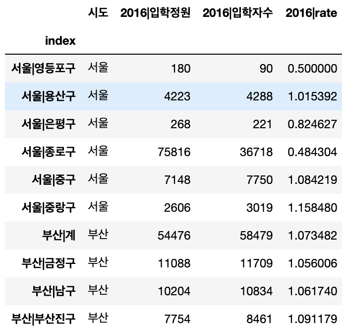

### 대학 입학 충원률 분석

#### 사용 데이터
- [KESS 교육통계서비스 행정구역별 입학정원](https://kess.kedi.re.kr/stats/school?menuCd=0102&cd=4181&survSeq=2019&itemCode=01&menuId=m_010207&uppCd1=010207&uppCd2=010207&flag=A)
> 2016 - 2020 년의 데이터 사용

- [KESS 교육통계서비스 행정구역별 입학자수](https://kess.kedi.re.kr/stats/school?menuCd=0102&cd=4154&survSeq=2019&itemCode=01&menuId=m_010207&uppCd1=010207&uppCd2=010207&flag=B)
> 2016 - 2020 년의 데이터 사용

- data.json : 출력파일
> 5년간 입학정원, 입학자수, 비율 분석 파일

